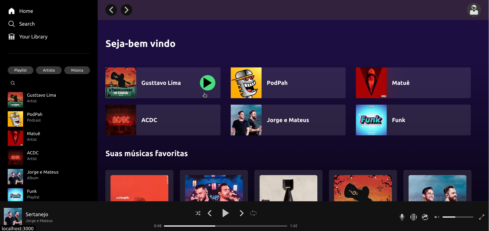
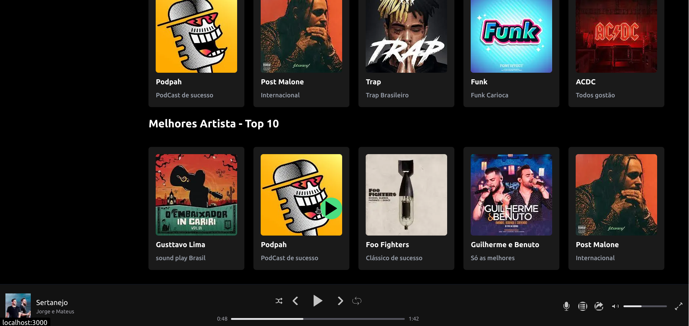

<h2><b>✏️ Sobre</b></h2> 

## Clone Spotify

<h2><b>  👨🏻‍💻 Bibliotecas utilizadas no projeto</b></h2>

- [NextJs](https://beta.nextjs.org/docs)

  - **NextJs** é um framework para React, pode ser utilizado para o desenvolvimento de aplicações/sites web com JavaScript.   

- [Tailwindcss](https://tailwindcss.com/)

  - O **Tailwind** CSS é um framework CSS de código aberto que permite criar rapidamente estilos personalizados para seus projetos. O mesmo fornece classes que podem ser combinadas para criar seus próprios estilos.

---

<h2><b> 🖥 Resultado final da aplicação</b></h2> 

---

<h2><b> 💻 Requisitos para rodar o projeto</b></h2>

- **Node.js** - version >= `18.9.0`
- **NPM** - version >= `9.5.1`
- **Next.js** - version >= `13.0.0`

---

<h2><b> 👨🏻‍💻 Como iniciar o Projeto:</b></h2> 

Efetuar o clone deste repositório, colando em seu terminal o seguinte comando:

`git clone https://github.com/jaocordeiro/clone_spotify.git`

Após clonar o repositório, acessar a pasta `clone_spotify` e rodar o comando **npm run dev** e o site estará rodando em seu
local.

---

<h2><b> 💻 O que foi feito</b></h2> 

  Neste repositório foi criado um clone da página home do spotify, trazendo as principais features da mesma, desde os ícones utilizados, até as listas de playlist listadas em sua página principal.

No aside da aplicação temos a nav que possui os botões de principais no topo que te levam a home, search e suas librarys, ainda na mesma temos as últimas playlists tocadas e search de busca dessas playlists ouvidas recentemente.

Na main do site passando o mouse em cima de cada álbum temos o hover do play, e 4 sections, na primeira temos as últimas playlists ouvidas e nas outras 3 sections temos um mix de suas músicas favoritas, as músicas que você as vezes escuta e as mais tocadas no Brasil. Além disso, temos no header da aplicação as navegações em setas dentro do spotify e o ícone do perfil.

O footer da aplicação temos o playlist que está sendo tocada atualmente, os comandos de música com barra de progresso da mesma e outros comandos como volume, letra dentre outros no canto inferior direito.

obs:. A aplicação está apenas web sem responsividade por enquanto.

---

 <h2><b>
Obrigado 😃
</b><h2>
